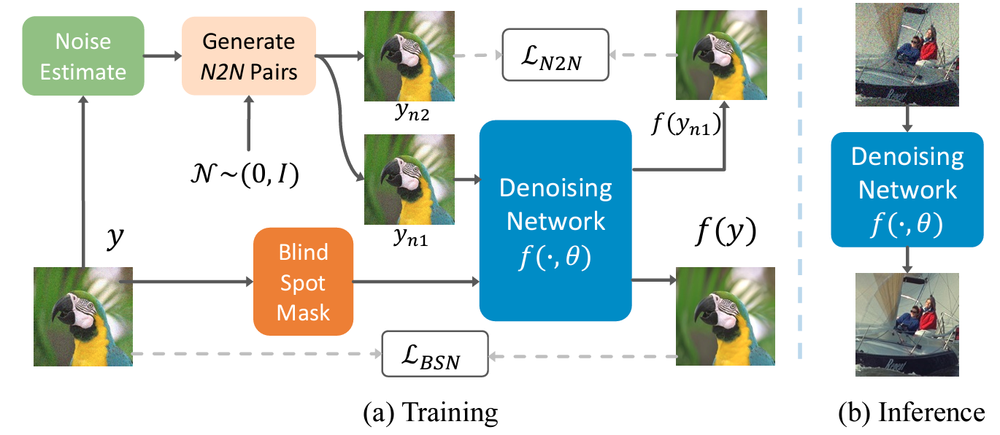

# DCD-Net
This is the code for [Iterative denoiser and noise estimator for self-supervised image denoising
](https://openaccess.thecvf.com/content/ICCV2023/papers/Zou_Iterative_Denoiser_and_Noise_Estimator_for_Self-Supervised_Image_Denoising_ICCV_2023_paper.pdf), ICCV 2023, by Yunhao Zou, Chenggang Yan and Ying Fu.

## Introduction
In this work, we propose a  Denoise-Corrupt-Denoise training pipeline (DCD-Net) for self-supervised image denoising. By iteratively updating the denoiser and noise estimator, DCD-Net achieves promising results on widely used image denoising benchmarks.



## Data Preparation
* Download [**SIDD-Medium Dataset**](https://abdokamel.github.io/sidd/)
* Put the datasets in folder ```./test_dir```, you can either use the SIDD validation set or testing set

## Evaluation
* We provide the pretrained model of our DCD-Net in ```./pretrained/dcd.pth```, we also provide our reimplementation of other denoising methods in folder ```./pretrained```, including fully supervised baseline (n2c), noise2noise (n2n), and noise2void (n2v)
* Run the following script for evaluation
```
bash test_sidd.py
```
# Citation
If you find this work useful for your research, please cite:
```
@inproceedings{zou2023iterative,
  title={Iterative denoiser and noise estimator for self-supervised image denoising},
  author={Zou, Yunhao and Yan, Chenggang and Fu, Ying},
  booktitle={Proceedings of the IEEE/CVF International Conference on Computer Vision},
  pages={13265--13274},
  year={2023}
}
```
## contact
If you have any problems, please feel free to contact me at zouyunhao@bit.edu.cn
# Acknowlegment
The code borrows from [**Blind2Unblind**](https://github.com/zejinwang/Blind2Unblind), and [**SimCLR**](https://github.com/sthalles/SimCLR), please also cite their work
